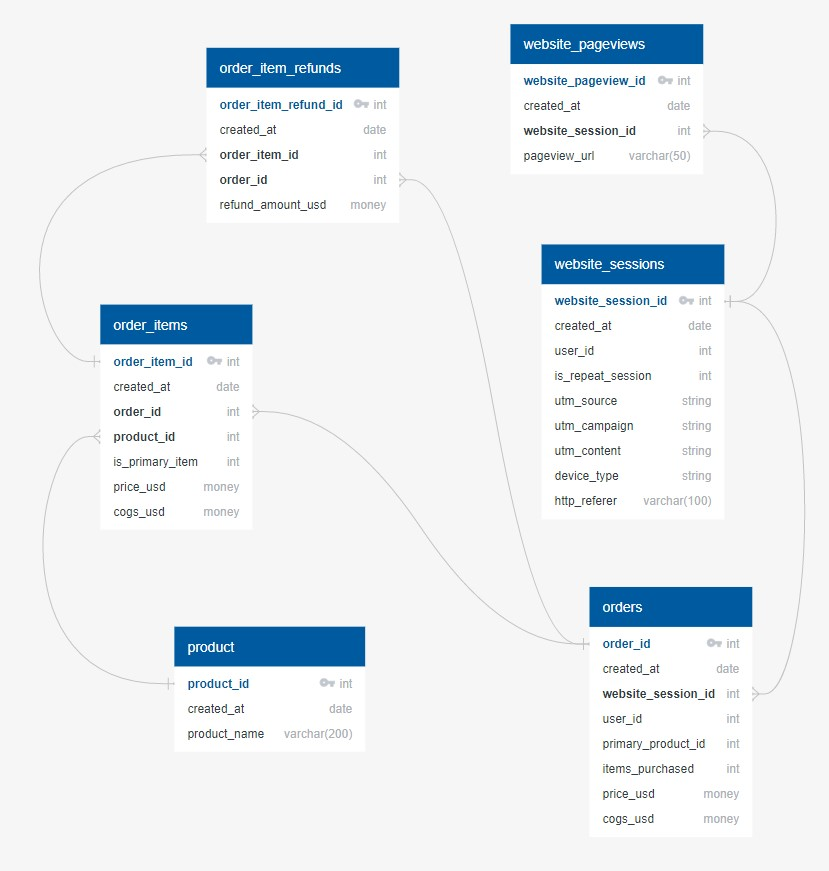

# MavenFuzzyFactory Analysis
## Business problem
The CEO has requested a thorough analysis of the sales data from the holiday season last year (November-December of 2014) to provide recommendations on how to boost sales in the upcoming holiday season. The focus is primarily on increasing the conversion rate while also uncovering additional valuable insights that can contribute to increased sales.

## The Database
The database contains Maven Fuzzy Factory's sales data for their stuffed animal toys from March 2012 to March 2015. The company offers four products, namely:
1.	The Original Mr. Fuzzy (launched on the 19.03.2012)
2.	The Forever Love Bear (launched on the 06.01.2013)
3.	The Birthday Sugar Panda (launched on the 12.12.2013)
4.	The Hudson River Mini Bear (launched on the 05.02.2014)
The company exclusively sells these products through their website. The database comprises six tables: order_item_refund, order_item, orders, products, website_pageviews, and website_sessions.

## Data Analysis
Let's begin by examining the key metrics from last November-December, including the number of website sessions, number of orders, and conversion rate, while comparing them with previous months.

Next, we'll delve deeper into factors affecting the conversion rate and identify insights that can help increase it.

### UTM Source
Maven Fuzzy Factory uses five different UTM sources to track their website traffic:
1.	Organic search
2.	Brand ads on search engines
3.	Nonbrand ads on search engines
4.	Direct type-in
5.	Social media ads

We'll analyze the conversion rate for each UTM source and determine which ones perform the best.

Insights on UTM Sources:

•	It's predicted that 'organic search,' 'brand ads,' and 'direct type-in' will have a high conversion rate since customers actively enter the website during these interactions.

•	Most orders come from nonbrand ads, which target customers unfamiliar with our company.

•	social media ads has the lowest convertion rate, and the company pays 1$ per sessions, lets see is it worth to keep paying

•	Social media ads have the lowest conversion rate.

We need to examine the key metrics from the social media ads

The social media ads have resulted in bringing 5,316 users to our website, and out of them, 736 have returned for more visits. The total margin from sales generated by these users amounts to $12,948. However, it's essential to consider the $2 cost incurred by the company for each session generated through the social media ads. Now, we need to determine if this investment is profitable and if it makes sense to continue with these ads.

Social media ads were launched in August 2014, and during that initial month, we incurred losses. However, since then, the ads have consistently generated profits each month. Since the launch, the cumulative profit stands at $2315. Based on this positive performance, I recommend continuing with the ads.

Let's revisit the UTM sources. A significant portion of our orders comes from nonbrand ads. Now, let's delve deeper into this aspect. We have nonbrand ads on both Bsearch and Gsearch. We'll analyze and compare their conversion rates to identify which one performs the best.

There isn't much difference between the two; both have a fairly high conversion rate. Search engines offer four different ads, each having a brand and a nonbrand version. Let's determine which ad performs the best among them. We will first analyze the desktop versions and then move on to the mobile ones.

b_ad_2 performs the best with a conversion rate of 11.8%. However, there aren't many sessions coming through this ad. To capitalize on its high conversion rate, I recommend increasing the volume of this ad.
On the other hand, g_ad_2 performs the worst with a conversion rate of 7.4%. This is surprising as brand ads typically have higher conversion rates. I would like to obtain the ad report to analyze this specific ad further and identify insights that can optimize its conversion rate.

The conversion rate of the mobile ads is notably lower compared to the desktop versions. There could be several possible explanations, but the primary one may be the mobile UI/UX not being as effective as the desktop version. To verify this hypothesis, I recommend conducting A/B testing with different versions of the website and analyzing the results. This will help us understand and address any issues related to mobile user experience and improve the overall conversion rate for mobile users.

### Website Pageviews

Let's determine the total number of pages in the website.

The website pages are organized based on the user's journey, starting from the Home and external landing pages, leading to the Products section, and finally culminating in the completion of the purchase.

The website consists of 10 pages, including Home, Products, Cart, Shipping, Billing, and Thank You pages, along with a dedicated page for each product. Additionally, there are 3 landing pages external to the main website, accessible through ads that direct users to these landing pages before leading them back to the website. 

The Products catalog receives the highest number of pageviews, which is understandable as all the landing pages and the home page direct users there.

Now, let's focus on analyzing the landing pages and determine the percentage of visitors who proceed to the main website after visiting each landing page.

Lander 2 has the highest bounce rate, while lander 5 has the lowest. The difference between them is significant, at 24%, indicating that the performance varies considerably between the two. As a lower bounce rate enhances the potential for selling more products, I recommend discontinuing the use of lander 2.

To optimize our landing pages further, I propose scheduling a meeting to investigate what contributed to the success of lander 5 and identify the factors that led to a higher bounce rate for lander 2. By understanding these insights, we can make necessary improvements and aim to minimize the bounce rate as much as possible across all our landing pages.

Let's examine the conversion funnel of the sales process, starting from the products catalog page and ending with the thank you for your order page.

